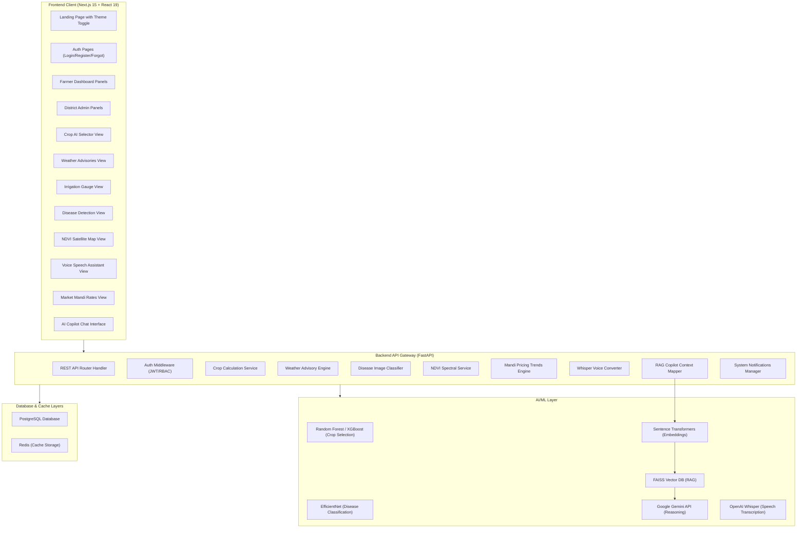
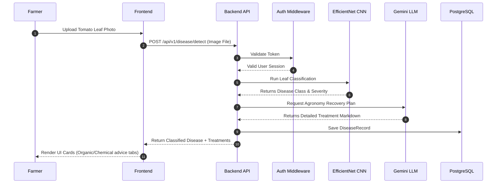

# 🗺️ KrishiBhoomi AI — System Architecture Mappings

This document defines the high-level architecture diagram and flow logic of KrishiBhoomi AI.

## 🏗️ High-Level System Architecture

## 🔄 Core Operational Flow (E.g. Disease Detection Pipeline)

