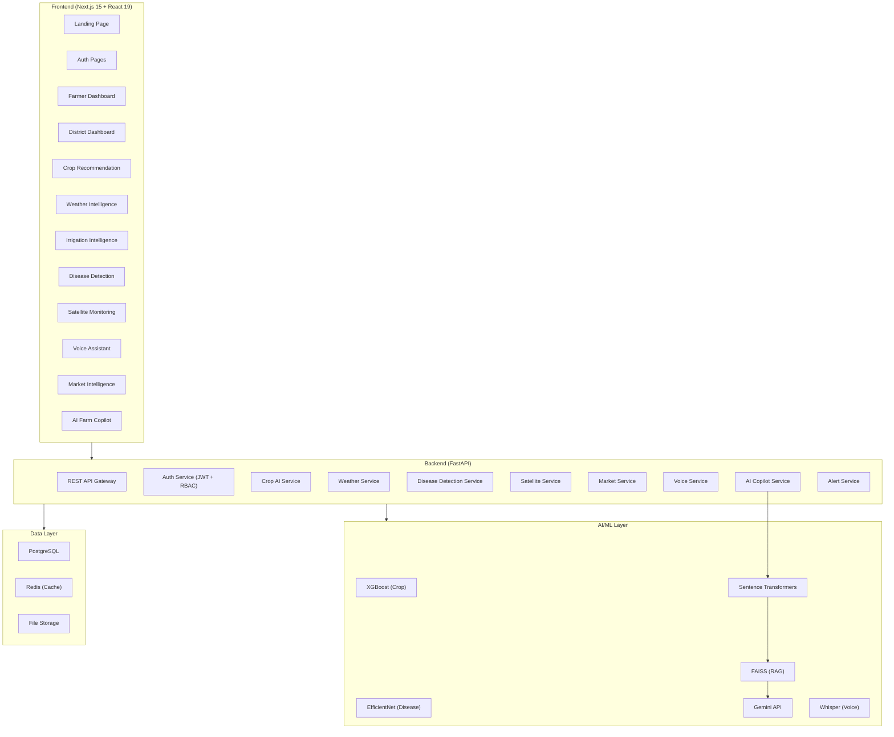

# KrishiBhoomi AI - System Documentation

## Architecture Design



## Setup & Running Locally

### Backend Setup
1. Navigate to the backend folder:
   ```bash
   cd backend
   ```
2. Set up virtual environment and install packages:
   ```bash
   python -m venv .venv
   .venv\Scripts\activate
   pip install -r requirements.txt
   ```
3. Run the FastAPI application:
   ```bash
   uvicorn app.main:app --reload --port 8000
   ```
4. Access API Docs: Go to `http://localhost:8000/docs`.

### Frontend Setup
1. Navigate to the frontend folder:
   ```bash
   cd frontend
   ```
2. Install packages and run Next.js server:
   ```bash
   npm install
   npm run dev
   ```
3. Access Platform: Go to `http://localhost:3000`.

### Docker Compose
To spin up all services including PostgreSQL databases, Redis, the APIs, and the client views:
```bash
docker-compose up --build
```
